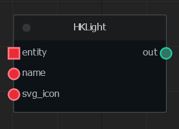
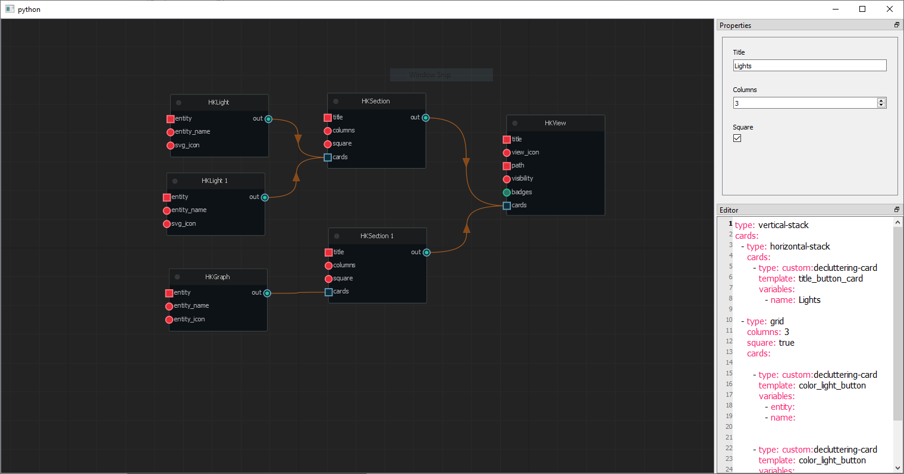
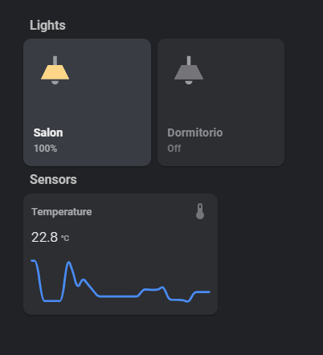

## HomeAssistant Custom Lovelace UI Editor

---

The idea of this development, is to facilitate the process of creating Custom Lovelace Dashboards using 
custom Lovelace Cards (like [button-card](https://github.com/custom-cards/button-card), 
[decluttering-card](https://github.com/custom-cards/decluttering-card), and so on...)

Basically, this app uses some user created themes. Those themes, contains card templates. Each of those templates,
are exposed as a Node within this app, allowing you to connect nodes between themselves, creating complex setups with 
really few nodes.

Here you have an example of a node from a theme that I'm working on called `Dark Homekit UI`:  


and the card template code behind that node:  
```yaml
type: custom:decluttering-card
template: color_light_button
variables:
  - entity: {{ entity }}
  - name: {{ name }}
  
  - svg_path: {{ svg_icon.svg_path }}
  - svg_path_on: {{ svg_icon.svg_path_on }}
  
```

The card template code is written as a `yaml` file. This is the code that will be used to setup your Dashboard.  

Let me show you a real example. From this graph here:


I've generated the following HA Dashboard  


And adding more a more cards is as easy as adding more nodes!

### Features
* Export graphs to use them in the future
* Import previously imported graphs! Keep all these ones safe in case you want to modify them in the future
* Create your own themes without knowing anything about programming. Just YAML and Jinja2
* Share with the community your creations
* Create as many nodes as you wish! The only limit here is your imagination!
* Create fully working dashboards based on the created themes.

### Installing
I've added a Windows binary for now. That's probably the easiest way to execute it. You can find it within the Releases page
If you want to install it from the source, first, you need a Python3.7+ installation in your machine.  
After that, you can follow these steps:
```
git clone https://github.com/asierralozano/ha-ui-editor.git
cd homeassitant-ui-editor
pip -r requirements.txt
python homeassistant_ui_editor/bootstrap.py
```

### Themes
Here I'll try to post every theme available:
* [Homekit UI Dark](https://github.com/asierralozano/homekit-ui) by Alberto Sierra Lozano

### TODOs
There are still a lot of things to do! I'm trying to work as much as I can on this project, because I think 
that it will make some people's life easier when tweaking their dashboard (starting by my father for example.)
I'll try to create an accurate TODO list! 


